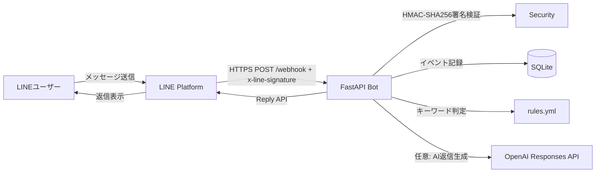
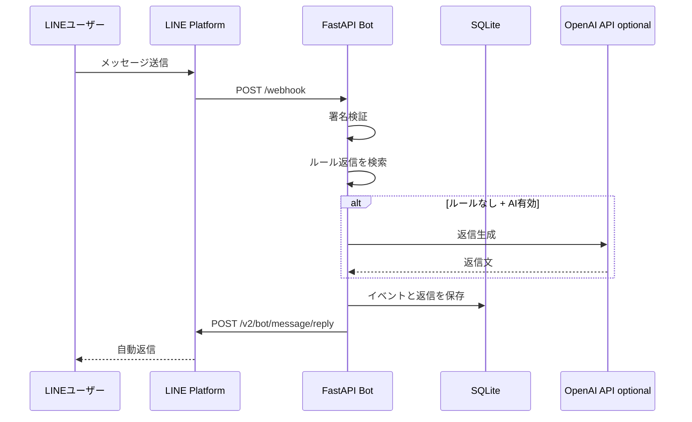

# LINE Official Auto Reply Bot

LINE公式アカウントに届いたメッセージをWebhookで受け取り、LINE Messaging APIのReply APIで自動返信するFastAPIアプリです。まずは安全なルール返信だけで動き、必要に応じてOpenAI Responses APIを使ったAI返信に切り替えられます。

## まず最初に読むもの

初心者の方は、次の順番で読んでください。

1. `docs/preparation.md` — LINE公式アカウント側で事前に準備するもの
2. `docs/setup.md` — このBotを起動してLINEにWebhook URLを登録する手順
3. `app/rules.yml` — 実際の自動返信文を編集するファイル

## 最短の事前準備チェックリスト

LINE側で事前に必要になるものは次の通りです。

| 準備するもの | どこで用意するか | このBotで使う場所 |
|---|---|---|
| LINE公式アカウント | LINE Official Account Manager | ユーザーが友だち追加するアカウント |
| Messaging APIチャネル | LINE Official Account ManagerでMessaging APIを有効化 | WebhookとReply APIの接続元 |
| Channel Secret | LINE Developers Console > Basic settings | `LINE_CHANNEL_SECRET` |
| Channel Access Token | LINE Developers Console > Messaging API | `LINE_CHANNEL_ACCESS_TOKEN` |
| HTTPS公開URL | Render / Fly.io / Cloud Run / Railway / VPSなど | `https://your-domain.example.com/webhook` |
| 任意: OpenAI API key | OpenAI Platform | `OPENAI_API_KEY` |

最初は `REPLY_MODE=rules` でルール返信だけを動かすのがおすすめです。AI返信はLINEとの接続確認後に `REPLY_MODE=hybrid` へ切り替えます。

## 調査結果

公式LINEには、LINE公式アカウント向けの **Messaging API** があります。ユーザーが友だち追加したりメッセージを送ったりすると、LINE PlatformがWebhook URLへHTTPS POSTを送ります。アプリ側はWebhookを受け取り、`/v2/bot/message/reply` にReply APIリクエストを送ることで返信できます。

また、Webhookには `x-line-signature` ヘッダーが付くため、Channel Secretを使ったHMAC-SHA256署名検証を行ってから処理します。IP制限ではなく署名検証で保護するのが基本です。

LINEは公式SDKも公開しており、Pythonを含む複数言語で利用できます。このリポジトリでは依存を最小化し、署名検証とReply API呼び出しを明示的に実装しています。

MCPについては、LINE公式が **LINE Bot MCP Server** をプレビュー版として公開しています。これはAIエージェントからLINE Messaging APIを使うための補助サーバーです。本リポジトリはリアルタイム自動返信をWebhookで実装し、MCP連携は `docs/mcp.md` に任意機能として整理しています。

## できること

- LINE公式アカウントのWebhook受信
- `x-line-signature` の署名検証
- テキストメッセージへの自動返信
- YAMLで管理するキーワード返信
- 任意でOpenAI Responses APIによるAI返信
- 友だち追加イベントへのウェルカム返信
- 非テキストメッセージへの案内返信
- SQLiteへのイベント・返信ログ保存
- Docker / Docker Compose起動
- GitHub Actions CIでlint・test実行
- Codespaces / devcontainer対応

## アーキテクチャ





## 初期設定

### 1. 事前準備を確認

```text
LINE公式アカウント
Messaging APIチャネル
Channel Secret
Channel Access Token
HTTPS公開URL
```

詳しくは `docs/preparation.md` を見てください。

### 2. 環境変数を用意

`.env.example` をコピーして `.env` を作ります。

```bash
cp .env.example .env
```

最低限必要な値はこの2つです。

```env
LINE_CHANNEL_SECRET=LINE Developers ConsoleのChannel Secret
LINE_CHANNEL_ACCESS_TOKEN=LINE Developers ConsoleのChannel access token
```

AI返信を使う場合だけ追加します。

```env
REPLY_MODE=hybrid
OPENAI_API_KEY=OpenAI API key
OPENAI_MODEL=gpt-5.5
```

ルール返信だけなら `OPENAI_API_KEY` は不要です。

### 3. ローカル起動

```bash
python -m venv .venv
source .venv/bin/activate
pip install -r requirements.txt
uvicorn app.main:app --reload --host 0.0.0.0 --port 8000
```

またはDockerで起動します。

```bash
docker compose up --build
```

ヘルスチェック:

```bash
curl http://localhost:8000/healthz
```

### 4. 公開URLをLINEのWebhook URLに設定

本番ではHTTPSで公開されたURLが必要です。

```text
https://your-domain.example.com/webhook
```

LINE Developers ConsoleのMessaging API設定でWebhook URLに登録し、Webhook利用を有効化します。LINE公式アカウント側の標準応答機能と併用すると二重返信になることがあるため、このBotに任せる運用では標準応答の設定も確認してください。

## 返信ルールの編集

`app/rules.yml` を編集します。

```yaml
keywords:
  - contains: 営業時間
    reply: "営業時間は平日10:00〜18:00です。"
```

`REPLY_MODE` は次の3種類です。

| 値 | 動作 |
|---|---|
| `rules` | ルール返信のみ |
| `ai` | 可能な限りAI返信 |
| `hybrid` | ルール優先、該当なしならAI返信 |

## 本番運用に必要なもの

- LINE公式アカウント
- LINE DevelopersのMessaging APIチャネル
- `LINE_CHANNEL_SECRET`
- `LINE_CHANNEL_ACCESS_TOKEN`
- HTTPSで公開できるホスティング環境
- 任意: `OPENAI_API_KEY`
- ログを残す永続ディスク、または外部DB
- メッセージ送信数の上限・課金プランの確認
- 障害時に人が確認できる運用フロー

## MCP連携について

リアルタイム自動返信はWebhook + Reply APIが最短です。AIエージェントからLINE公式アカウントへ対話的に配信したい場合は、LINE公式のLINE Bot MCP Serverを併用できます。詳細は `docs/mcp.md` を見てください。

## GPT Imageで構成図を作るためのプロンプト

READMEや社内説明資料に画像の構成図を載せたい場合は、次のプロンプトをGPT Imageの最新モデルに入力してください。

```text
LINE公式アカウントの自動返信システムのアーキテクチャ図を日本語で作成してください。登場要素は、LINEユーザー、LINE Platform、FastAPI Webhook Server、署名検証、rules.yml、任意のOpenAI Responses API、SQLiteログ、LINE Reply APIです。左から右に処理が流れるシンプルなクラウドアーキテクチャ図にし、初心者にもわかる注釈を入れてください。
```

## 開発

```bash
pip install -r requirements.txt
ruff check .
pytest -q
```

## 主要ファイル

| ファイル | 役割 |
|---|---|
| `app/main.py` | FastAPIのWebhook入口 |
| `app/security.py` | LINE署名検証 |
| `app/line_client.py` | LINE Reply API呼び出し |
| `app/responder.py` | ルール返信・AI返信の振り分け |
| `app/ai_client.py` | OpenAI Responses API連携 |
| `app/storage.py` | SQLiteログ |
| `app/rules.yml` | 返信ルール |
| `docs/preparation.md` | 事前準備チェックリスト |
| `docs/setup.md` | LINE側の設定手順 |
| `docs/architecture.md` | 詳細アーキテクチャ |
| `docs/mcp.md` | MCP連携メモ |

## ライセンス

MIT
