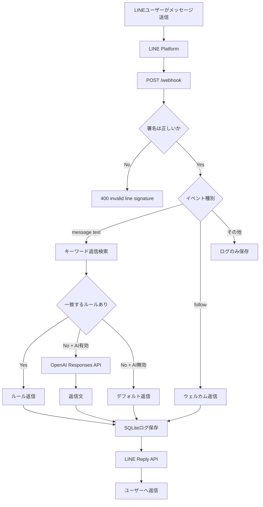

# アーキテクチャ

このアプリは、LINE公式アカウントのMessaging API Webhookを受信し、署名検証後に自動返信する最小構成のBotサーバーです。

## コンポーネント

| コンポーネント | 役割 |
|---|---|
| LINEユーザー | 公式LINEにメッセージを送る人 |
| LINE Platform | Webhook送信とReply APIの受付 |
| FastAPI Bot | Webhook受信、署名検証、返信生成、ログ保存 |
| `app/security.py` | `x-line-signature` のHMAC-SHA256検証 |
| `app/responder.py` | ルール返信とAI返信の選択 |
| `app/rules.yml` | キーワード返信の管理 |
| OpenAI Responses API | 任意。ルールに該当しない問い合わせのAI返信 |
| SQLite | 受信イベント、返信文、source IDの保存 |
| GitHub Actions | lint、test、artifact upload |

## 全体フロー



## セキュリティ設計

LINE Webhookでは、受信したリクエスト本文を変更せず、Channel SecretでHMAC-SHA256を計算します。計算結果を `x-line-signature` と比較し、一致しない場合はイベントを処理しません。

署名検証の前にJSON整形やパース結果を使って検証すると失敗するため、`await request.body()` で受け取った生のbytesをそのまま使います。

## 返信生成の優先順位

1. ハンドオフキーワード
2. `app/rules.yml` のキーワード返信
3. `REPLY_MODE=hybrid` または `ai` かつ `OPENAI_API_KEY` がある場合はAI返信
4. デフォルト返信

## データ保存

SQLiteに以下を保存します。

- 受信時刻
- イベント種別
- source ID
- ユーザーのテキスト
- 返信テキスト
- raw event JSON

本番で長期運用する場合は、PostgreSQLなどの外部DBへ置き換えることを推奨します。

## CI/CD

GitHub Actionsでは次を実行します。

1. checkout
2. Python 3.12 setup
3. 依存関係インストール
4. `ruff check .`
5. `pytest -q`
6. artifact upload

## GPT Image用の構成図プロンプト

```text
LINE公式アカウントの自動返信Botのクラウドアーキテクチャ図を作成してください。LINEユーザー、LINE Platform、FastAPI Webhook Server、署名検証、rules.yml、OpenAI Responses API optional、SQLite、LINE Reply API、GitHub Actions CIを含めてください。日本語ラベル、左から右への流れ、初心者向けの短い注釈を付けてください。
```
