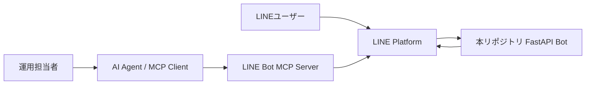

# MCP連携メモ

## 結論

自動返信そのものは、LINE Messaging APIのWebhook + Reply APIで実装するのが最短です。

MCPは、AIエージェントがLINE Messaging APIをツールとして操作する用途に向いています。たとえば、管理者がAIエージェントに「この内容を友だち全員へ配信して」や「このユーザーに案内を送って」と依頼する運用です。

## LINE Bot MCP Server

LINE公式は、Messaging API向けのLINE Bot MCP Serverをプレビュー版として公開しています。これはClaudeなどのMCPクライアントやAIエージェントからLINE公式アカウントを操作するためのサーバーです。

## このリポジトリとの役割分担

| 項目 | このリポジトリ | LINE Bot MCP Server |
|---|---|---|
| ユーザーから来たメッセージへの即時返信 | 得意 | 主目的ではない |
| Webhook受信 | あり | 主目的ではない |
| Reply Tokenを使った返信 | あり | 用途次第 |
| 管理者がAIエージェントから配信指示 | 任意で追加 | 得意 |
| 実験的なAIエージェント操作 | 任意 | 得意 |

## 推奨構成

## 実装方針

このリポジトリはリアルタイム返信に集中しています。MCPを追加する場合は、別プロセスとしてLINE Bot MCP Serverを起動し、同じLINE Channel Access TokenをSecretとして渡す構成にしてください。

Secretの管理は次のように分けます。

- このBot: `LINE_CHANNEL_SECRET`, `LINE_CHANNEL_ACCESS_TOKEN`
- MCP Server: `CHANNEL_ACCESS_TOKEN` など、MCP Server側READMEで指定されたSecret
- OpenAI連携: `OPENAI_API_KEY`

GitHubやREADMEに実Secret値は書かないでください。
