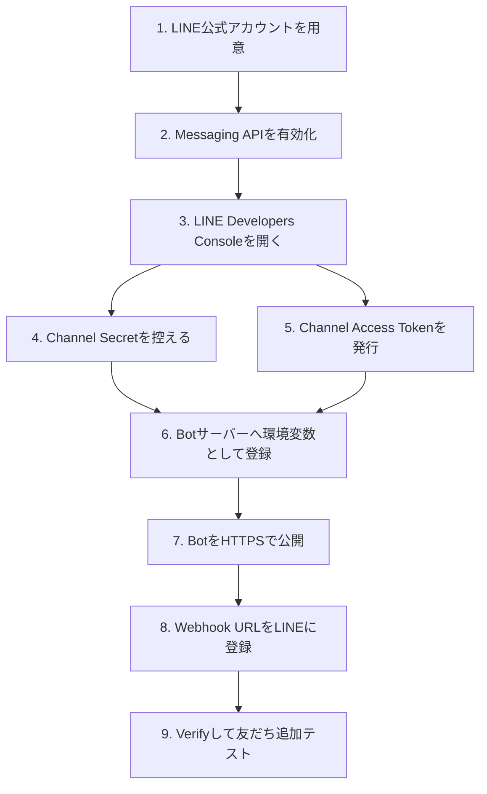

# 事前準備ガイド

このページは、LINE公式アカウントに届いたメッセージをBotで自動返信する前に準備するものを、初心者向けに順番で整理したものです。

## 全体像



## 事前準備チェックリスト

| No | 準備 | 完了したらチェック |
|---:|---|---|
| 1 | LINE公式アカウントを作る | `[ ]` |
| 2 | Messaging APIを有効化する | `[ ]` |
| 3 | LINE Developers Consoleで対象チャネルを開ける状態にする | `[ ]` |
| 4 | Channel Secretを取得する | `[ ]` |
| 5 | Channel Access Tokenを発行する | `[ ]` |
| 6 | Botを置くサーバー、またはホスティング先を決める | `[ ]` |
| 7 | HTTPSの公開URLを用意する | `[ ]` |
| 8 | 自動返信ルールを決める | `[ ]` |
| 9 | 任意: AI返信を使う場合はOpenAI API keyを用意する | `[ ]` |
| 10 | LINE公式アカウント側の標準応答と二重返信にならないか確認する | `[ ]` |

## 1. LINE公式アカウントを用意する

すでにLINE公式アカウントがある場合は、この手順は完了です。

まだない場合は、LINE Official Account Managerで公式アカウントを作成します。ユーザーが友だち追加してメッセージを送る相手が、このLINE公式アカウントです。

決めておくとよい項目:

- アカウント名
- 業種、ブランド名、店舗名
- アイコン画像
- ユーザーへ見せるプロフィール説明
- 問い合わせ対応時間

## 2. Messaging APIを有効化する

LINE公式アカウントでBot連携をするには、Messaging APIを有効化します。

有効化すると、LINE Developers Console側にMessaging APIチャネルが作られます。このチャネルが、BotサーバーとLINE公式アカウントをつなぐ設定場所になります。

## 3. LINE Developers Consoleで対象チャネルを開く

LINE Developers Consoleにログインし、対象のProviderとMessaging APIチャネルを開きます。

確認する場所:

- Provider名
- Channel名
- Channel ID
- Basic settings
- Messaging APIタブ

複数のLINE公式アカウントやProviderがある場合は、別のチャネルを開かないように注意してください。

## 4. Channel Secretを取得する

`Channel Secret` は、LINEから来たWebhookが本物かどうかを確認するための秘密鍵です。

このBotでは、Webhook受信時に `x-line-signature` を検証するために使います。

`.env` や本番環境のSecretには次の名前で登録します。

```env
LINE_CHANNEL_SECRET=ここにChannel Secretを入れる
```

注意:

- GitHubに直接書かないでください。
- READMEやIssueにも貼らないでください。
- 間違ったChannel Secretを入れると、Webhookが `invalid line signature` で失敗します。

## 5. Channel Access Tokenを発行する

`Channel Access Token` は、BotサーバーがLINE Reply APIを呼び出すための認証トークンです。

このBotでは、ユーザーへ返信するときに使います。

`.env` や本番環境のSecretには次の名前で登録します。

```env
LINE_CHANNEL_ACCESS_TOKEN=ここにChannel Access Tokenを入れる
```

注意:

- GitHubに直接書かないでください。
- ChatGPTや公開ドキュメントにも貼らないでください。
- Tokenが空のまま `DRY_RUN=false` で動かすと、LINEへの返信送信に失敗します。

## 6. Botを置く場所を決める

LINEのWebhookは、インターネットからアクセスできるHTTPS URLへ送られます。ローカルPCの `localhost` はLINEから直接アクセスできません。

本番候補:

| 候補 | 向いている用途 |
|---|---|
| Render | 小〜中規模、簡単にWebアプリ公開したい場合 |
| Fly.io | Dockerで軽量に運用したい場合 |
| Google Cloud Run | Google Cloudで本番運用したい場合 |
| Railway | 試作を素早く公開したい場合 |
| VPS | 自分でサーバー管理したい場合 |

ローカル検証だけなら、ngrokやCloudflare Tunnelで一時的なHTTPS URLを作れます。

## 7. 環境変数を整理する

最初は次の最小構成で十分です。

```env
LINE_CHANNEL_SECRET=取得したChannel Secret
LINE_CHANNEL_ACCESS_TOKEN=取得したChannel Access Token
DRY_RUN=false
REPLY_MODE=rules
DATABASE_URL=sqlite:///./data/line_events.db
```

AI返信を使う場合だけ、次を追加します。

```env
REPLY_MODE=hybrid
OPENAI_API_KEY=OpenAIのAPI key
OPENAI_MODEL=gpt-5.5
```

返信テストだけをLINEへ送信せずに行う場合は、ローカルで一時的に次のようにできます。

```env
DRY_RUN=true
```

ただし、本番でLINEへ実際に返信するには `DRY_RUN=false` にします。

## 8. 自動返信ルールを決める

まずはAI返信よりも、確実に返したい定型文を `app/rules.yml` に書くのがおすすめです。

例:

```yaml
keywords:
  - contains: 営業時間
    reply: "営業時間は平日10:00〜18:00です。"
  - contains: 予約
    reply: "ご予約ありがとうございます。ご希望日時、お名前、人数を送ってください。"
```

優先順位:

1. ハンドオフキーワード
2. キーワード返信
3. AI返信、ただし `REPLY_MODE=hybrid` か `REPLY_MODE=ai` の場合のみ
4. デフォルト返信

## 9. Webhook URLを設定する準備

Botをデプロイしたら、LINE Developers Consoleに次の形式でWebhook URLを登録します。

```text
https://your-public-domain.example.com/webhook
```

設定前に、次を確認してください。

- `/healthz` が200を返す
- `/webhook` までHTTPSで到達できる
- 本番環境に `LINE_CHANNEL_SECRET` と `LINE_CHANNEL_ACCESS_TOKEN` を登録済み
- `DRY_RUN=false` になっている

## 10. LINE側でWebhookを有効化する

LINE Developers ConsoleのMessaging API設定で、Webhook URLを登録し、Webhook利用を有効化します。

Webhook redeliveryを有効化すると、LINE側からの再送を受けられる場合があります。運用方針に合わせて有効化してください。

## 11. Verifyと実機テスト

Webhook URLを保存したら、LINE Developers ConsoleのVerifyを実行します。

その後、LINE公式アカウントを友だち追加して、実際にメッセージを送ります。

テスト例:

```text
営業時間を教えて
予約したい
料金を知りたい
担当者に代わって
```

期待する動作:

- `営業時間` を含むメッセージには営業時間の定型返信
- `予約` を含むメッセージには予約案内
- `担当者` や `解約` などはハンドオフ案内
- 該当キーワードなしの場合はデフォルト返信、またはAI返信

## 12. 二重返信を避ける

LINE公式アカウント側に標準の応答メッセージや自動応答が残っていると、このBotの返信とあわせて二重に返信される場合があります。

確認するもの:

- あいさつメッセージ
- 応答メッセージ
- AI応答メッセージ
- チャット設定
- Webhook利用設定

運用ルールとして、このBotに一次対応を任せるのか、LINE公式アカウント標準機能も併用するのかを決めてください。

## 13. 本番前チェック

| 項目 | 確認内容 |
|---|---|
| Secret管理 | GitHubにSecretをコミットしていない |
| HTTPS | Webhook URLがHTTPSで公開されている |
| 署名検証 | `LINE_CHANNEL_SECRET` が正しい |
| 返信Token | `LINE_CHANNEL_ACCESS_TOKEN` が正しい |
| 返信モード | 最初は `REPLY_MODE=rules` 推奨 |
| ログ | SQLiteの保存先が永続化されている |
| 料金 | LINE公式アカウントのプラン・送信数上限を確認済み |
| 人への引き継ぎ | クレーム、解約、個人情報などの対応方針を決めている |

## 14. つまずきやすいポイント

### Verifyが失敗する

原因候補:

- Webhook URLが間違っている
- HTTPSではない
- アプリが起動していない
- `LINE_CHANNEL_SECRET` が違う
- サーバーがPOST `/webhook` を受けられない

### `invalid line signature` になる

原因候補:

- Channel Secretが別チャネルのもの
- リクエスト本文をプロキシやミドルウェアが改変している
- LINE Developers Consoleで別のMessaging APIチャネルを見ている

### 返信されない

原因候補:

- `LINE_CHANNEL_ACCESS_TOKEN` が空、または間違っている
- `DRY_RUN=true` のまま本番運用している
- Reply Tokenが期限切れになっている
- Webhook利用が無効
- アプリログにReply APIエラーが出ている

## 15. GPT Imageで手順画像を作るプロンプト

初心者向けの社内手順書や操作ガイドに画像を入れたい場合は、GPT Imageの最新モデルに次のプロンプトを入力してください。

```text
LINE公式アカウントの自動返信Botを始めるための事前準備手順を、日本語の初心者向けインフォグラフィックとして作成してください。手順は、LINE公式アカウント作成、Messaging API有効化、LINE Developers ConsoleでChannel Secret取得、Channel Access Token発行、Botサーバーに環境変数登録、HTTPS公開URLの準備、Webhook URL登録、Verify、友だち追加テストです。各ステップに番号を付け、迷いやすい注意点を短く添えてください。
```
